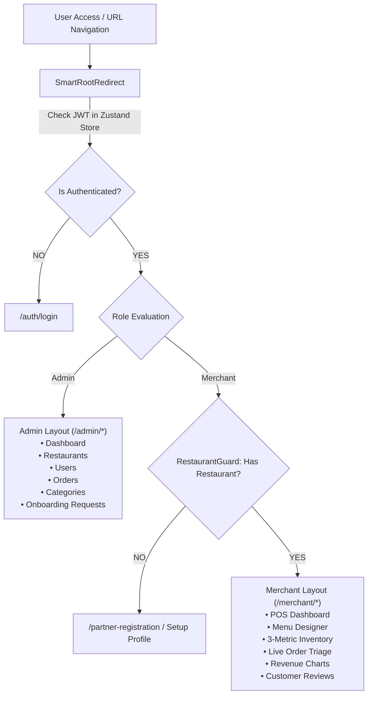

# 🛡️ QuickBite Admin & Merchant Portal

<p align="center">
  
  
  
  
  
  
</p>

---

## 📌 Overview

**QuickBite Admin & Merchant Portal** is the high-performance operations cockpit for platform administrators and restaurant merchants. Engineered with **React 19**, **Vite 8**, and **TypeScript**, the Single Page Application (SPA) provides instantaneous response times, real-time POS order triage, rich visual revenue analytics via **Recharts 3**, and multi-level route protection.

The application communicates exclusively with the **API Gateway BFF (Port 3001)** and features a resilient **Silent Token Refresh Queue** that transparently renews expired OAuth2 tokens without interrupting user workflows.

---

## 🏛️ Architecture & Route Guard Hierarchy



---

## 🌟 Key Features

### 1. Dual-Role Operations Cockpit
* **Administrator Portal (6 Modules):**
  * `/admin/dashboard`: Platform-wide gross volume, active orders, and merchant growth charts.
  * `/admin/restaurants`: Restaurant management, status overrides, and menu inspections.
  * `/admin/users`: User registry and RBAC role assignment (`Admin`, `Merchant`, `Customer`).
  * `/admin/orders`: Global order audit log with multi-criteria filtering.
  * `/admin/categories`: Taxonomy management for platform food categories.
  * `/admin/requests`: Partner registration review center with one-click atomic approval.
* **Merchant Operations & POS (7 Modules):**
  * `/merchant/dashboard`: Real-time restaurant status metrics and quick order triage.
  * `/merchant/menu`: Visual menu builder (categories, food items, sizing variants, toppings).
  * `/merchant/inventory`: Real-time **3-metric inventory management** (`quantity`, `reservedQuantity`, `availableQuantity`) with restock controls.
  * `/merchant/orders`: Live POS fulfillment queue (`Preparing` ➔ `Delivering` ➔ `Completed`).
  * `/merchant/revenue`: Interactive revenue and order breakdown powered by **Recharts 3**.
  * `/merchant/reviews`: Customer rating stream and feedback tracking.
  * `/merchant/profile`: Address updates and GPS store pin coordinates.

### 2. Silent Token Refresh Queue (`axiosClient.ts`)
* Intercepts HTTP 401 Unauthorized responses from expired access tokens.
* Pauses all concurrent in-flight requests into an execution queue.
* Silently invokes `/connect/token` via the API Gateway using the stored `refresh_token`.
* Replays all queued requests with the renewed token with zero UI flickering or user interruption.

### 3. High-Performance Data Fetching & Caching
* Built on **TanStack Query v5** (`@tanstack/react-query`) with automatic background refetching, mutation rollback, and caching.

---

## 🛠️ Technology Stack & Dependencies

| Component | Technology | Description |
|---|---|---|
| **Framework & Build Tool** | `React 19.2.8` + `Vite 8.2.0` | Ultra-fast Hot Module Replacement (HMR) and optimized build |
| **Language** | `TypeScript 6.x` | Strict type safety across all DTOs and view models |
| **Styling** | `Tailwind CSS v4.0` (`@tailwindcss/vite`) | Modern CSS utility framework |
| **Data Fetching & Cache** | `TanStack Query 5.101.4` + `Axios 1.19.0` | Server state management and automatic background synchronization |
| **Client State Management** | `Zustand 5.0.14` | LocalStorage-persisted authentication store (`authStore.ts`) |
| **Routing & Guards** | `React Router DOM 7.18.2` | Declarative routing with layout nesting and role guards |
| **Data Visualization** | `Recharts 3.10.1` | Responsive SVG charts (Area, Bar, Line, Pie) for revenue trends |
| **Interactive Maps** | `Leaflet 1.9.4` | Merchant restaurant GPS location picker |
| **Animations** | `Anime.js 4.5.0` + `Lucide React` | Cold-start BootScreen and UI micro-interactions |

---

## 📂 Project Structure

```
quick-bite-admin-portal/
├── src/
│   ├── layouts/                         # AdminLayout, MerchantLayout, AuthLayout
│   ├── guards/                          # AuthGuard, RestaurantGuard, SmartRootRedirect
│   ├── pages/                           # Application Views
│   │   ├── admin/                       # Admin pages (Dashboard, Restaurants, Users, Orders, Requests)
│   │   ├── merchant/                    # Merchant pages (Dashboard, Menu, Inventory, POS, Revenue)
│   │   └── auth/                        # Login & Registration views
│   ├── components/                      # UI Components
│   │   ├── charts/                      # Recharts visualizers (RevenueChart, OrderDistributionChart)
│   │   ├── common/                      # BootScreen, Table, Pagination, Navbar, Sidebar
│   │   └── ui/                          # Modals, Dropdowns, Badges, Toast notifications
│   ├── services/                        # API client services communicating with Gateway BFF
│   ├── stores/                          # Zustand stores (authStore.ts, toastStore.ts)
│   ├── types/                           # TypeScript models, enums, API DTOs
│   ├── lib/                             # Axios client instance with silent refresh queue
│   ├── App.tsx                          # App router definitions and query provider setup
│   └── main.tsx                         # Vite application entry point
├── index.html                           # HTML template
└── vite.config.ts                       # Vite 8 configuration with Tailwind v4 plugin
```

---

## ⚙️ Environment Variables (.env)

```env
# API Gateway Base URL (Directs all API requests to the edge Gateway)
VITE_API_GATEWAY_URL=http://localhost:3001

# Identity Service Direct URL (Optional: for direct OAuth endpoints)
VITE_IDENTITY_URL=http://localhost:44391
```

---

## 🔌 Operational Pages Summary

| Route | Role Guard | Purpose |
|---|---|---|
| `/admin/dashboard` | Admin | Aggregate GMV, revenue charts, and platform KPIs |
| `/admin/restaurants` | Admin | Manage all restaurants, inspect menus, and toggle active states |
| `/admin/users` | Admin | Account registry, role modifications, and status management |
| `/admin/orders` | Admin | Comprehensive platform-wide order search and status timeline |
| `/admin/requests` | Admin | Partner application triage with automated approval flow |
| `/merchant/dashboard` | Merchant | Quick POS status overview and daily order count |
| `/merchant/menu` | Merchant | Add/edit dishes, sizing variants, prices, and toppings |
| `/merchant/inventory` | Merchant | 3-metric stock monitor (`quantity`, `reserved`, `available`) |
| `/merchant/orders` | Merchant | Live POS order processing (`Preparing` ➔ `Delivering` ➔ `Completed`) |
| `/merchant/revenue` | Merchant | Detailed financial charts and period-based earnings breakdown |

---

## 🚀 Getting Started

### Prerequisites
* [Node.js 20.11+ LTS](https://nodejs.org/)
* Running **API Gateway (Port 3001)**

### 1. Installation
```bash
npm install
```

### 2. Running in Development
```bash
npm run dev
```
The development server will start at `http://localhost:5173`.

### 3. Production Build & Preview
```bash
npm run build
npm run preview
```
