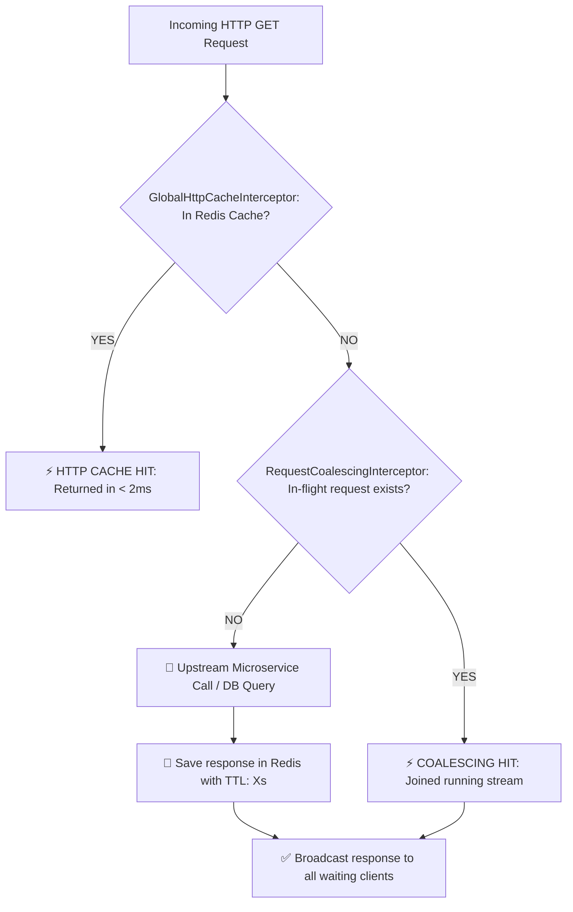

# 🌐 QuickBite API Gateway & BFF (Backend for Frontend)

<p align="center">
  
  
  
  
  
</p>

---

## 📌 Overview

**QuickBite API Gateway & BFF** is the single entry-point and high-performance edge orchestrator of the QuickBite ecosystem. Built with **NestJS 11**, it shields internal microservices, performs in-flight **JWKS RS256 token verification at the edge**, manages rate limiting, and serves aggregated BFF payloads for the Admin and Merchant portals.

To deliver ultra-low latency (< 2ms) and eliminate upstream overload, the gateway implements an advanced **2-Layer Caching & Concurrency Pipeline** featuring a **Global HTTP GET Redis Cache** and an in-flight **Request Coalescing Interceptor** (preventing Thundering Herd / Cache Stampede), backed by a **3-tier Dynamic Configuration Engine**.

---

## ⚡ 2-Layer Performance Pipeline



1. **Global HTTP GET Redis Cache (`GlobalHttpCacheInterceptor`):** Transparently caches all successful GET requests in Redis with dynamic TTL (`GET_CACHE_TTL`, 0s–120s). Reduces downstream traffic to 0% on cache hits.
2. **Request Coalescing Interceptor (`RequestCoalescingInterceptor`):** Employs RxJS `shareReplay` to collapse multiple identical concurrent requests into a **single upstream call**, broadcasting the shared result to all awaiting clients simultaneously.

---

## ⚙️ 3-Tier Dynamic Configuration Engine

The Gateway evaluates configuration keys (e.g., service URLs, rate limits, cache TTLs) via an automated 3-tier fallback chain:

```
Request Config Key (e.g., ORDER_URL, RATE_LIMIT_MAX, GET_CACHE_TTL)
                          │
                          ▼
             [ 1. Check Redis Cache ]
             (Key: gateway:config:{key}, TTL: 60s)
                          │
            ┌─────────────┴─────────────┐
        (Cache Hit)                (Cache Miss)
            │                           │
            ▼                           ▼
       Return Value          [ 2. Query MongoDB ]
                             (Collection: gateway_configs)
                                        │
                         ┌──────────────┴──────────────┐
                     (Found)                       (Not Found / Offline)
                         │                                     │
                         ▼                                     ▼
                Save to Redis & Return               [ 3. Local .env Fallback ]
```

---

## 🛠️ Technology Stack & Dependencies

| Component | Technology | Description |
|---|---|---|
| **Framework** | `NestJS 11.0.1` (`@nestjs/core`, `@nestjs/platform-express`) | High-performance edge web framework |
| **HTTP Proxy Client** | `@nestjs/axios` (Axios 1.19.0) | Upstream service proxying & aggregation |
| **Distributed Cache** | `ioredis 6.0.0` | High-throughput Redis client for GET cache & config |
| **Dynamic Config DB** | `mongoose 9.9.1` | MongoDB document persistence for runtime configs |
| **Rate Limiter** | `@nestjs/throttler 6.5.0` | Token bucket / sliding window rate limiting |
| **Token Verification** | `jwks-rsa 4.1.0` + `passport-jwt 4.0.1` | Edge RS256 signature verification |
| **Concurrency Stream** | `rxjs 7.8.2` (`shareReplay`) | In-flight request deduplication |

---

## 📂 Project Structure

```
quick-bite-api-gateway/
└── src/
    ├── auth/                            # Edge JWT Token Guard, JWKS strategy & role validators
    ├── proxy/                           # Reverse proxy forwarding requests to microservices
    ├── admin/                           # Admin BFF Aggregators (Dashboard & Detailed Reports)
    ├── merchant/                        # Merchant BFF Aggregators (POS, live orders, metrics)
    ├── cache/                           # Redis Cache Service & GlobalHttpCacheInterceptor
    ├── config/                          # DynamicConfigService & Config Controller (/api/config)
    ├── health/                          # Diagnostics & Fan-out Cold-start Wake-up Trigger
    ├── common/                          # Rate limiting, logging interceptors, and filters
    ├── app.module.ts                    # Main module assembling controllers and interceptors
    └── main.ts                          # Bootstrap entry point (Port 3001)
```

---

## ⚙️ Environment Variables (.env)

```env
# Server
PORT=3001
NODE_ENV=development

# Redis Distributed Cache
REDIS_HOST=localhost
REDIS_PORT=6379
REDIS_USERNAME=
REDIS_PASSWORD=

# MongoDB Dynamic Config
MONGODB_URI=mongodb://localhost:27017/quickbite_gateway

# Rate Limiting & Performance
RATE_LIMIT_TTL=60000
RATE_LIMIT_MAX=100
# Global HTTP GET Cache TTL in seconds (0 = disabled, max: 120, default: 30)
GET_CACHE_TTL=30

# Request Coalescing (In-flight concurrency deduplication)
COALESCING_ENABLED=true
COALESCING_EXCLUDE_PATHS=
COALESCING_ADDITIONAL_HEADERS=

# Upstream Microservice URLs
IDENTITY_URL=http://localhost:44391
ORDER_URL=http://localhost:44386/api/app
CATALOG_URL=http://localhost:3000
INVENTORY_URL=http://localhost:8083/api/v1
PAYMENT_URL=http://localhost:8084/v1
```

---

## 🔌 API Endpoints & Routes

**Default Port:** `3001`

### 1. Reverse Proxy Routes
All requests to `/api/catalog/*`, `/api/orders/*`, `/api/inventory/*`, `/api/payments/*`, and `/api/identity/*` are validated at the edge (JWKS RS256) and transparently forwarded to upstream microservices with correlation IDs (`x-correlation-id`).

### 2. Admin BFF Reports Endpoints
* `GET /api/admin/reports/charts`: Aggregated revenue trends, completed vs. cancelled order breakdown by date range (`startDate`, `endDate`, `status`, `merchantId`). (Cached in Redis)
* `GET /api/admin/reports/details`: Paginated multi-service order table with customer, restaurant, item count, and payment info. (Cached in Redis)

### 3. Dynamic Configuration Endpoints
* `GET /api/config/:key`: Read active configuration value (Evaluates Redis ➔ MongoDB ➔ .env).
* `POST /api/config/:key`: Update dynamic configuration in MongoDB and invalidate Redis cache in real time without restarting the gateway.

### 4. Diagnostics & Wake-up Probe
* `GET /api/health`: Health inspection of Redis, MongoDB, and service connections.
* `GET /api/system/health/wake-up`: Fan-out parallel health probe to wake up all downstream services on cloud scale-to-zero hosting (Render, Koyeb).

---

## 🚀 Getting Started

### Prerequisites
* [Node.js 20.11+ LTS](https://nodejs.org/)
* [Redis 6+](https://redis.io/)
* [MongoDB 6+](https://www.mongodb.com/)

### 1. Installation
```bash
npm install
```

### 2. Running the Gateway
```bash
# Development mode
npm run start:dev

# Production build and start
npm run build
npm run start:prod
```
The gateway will start at `http://localhost:3001`.
