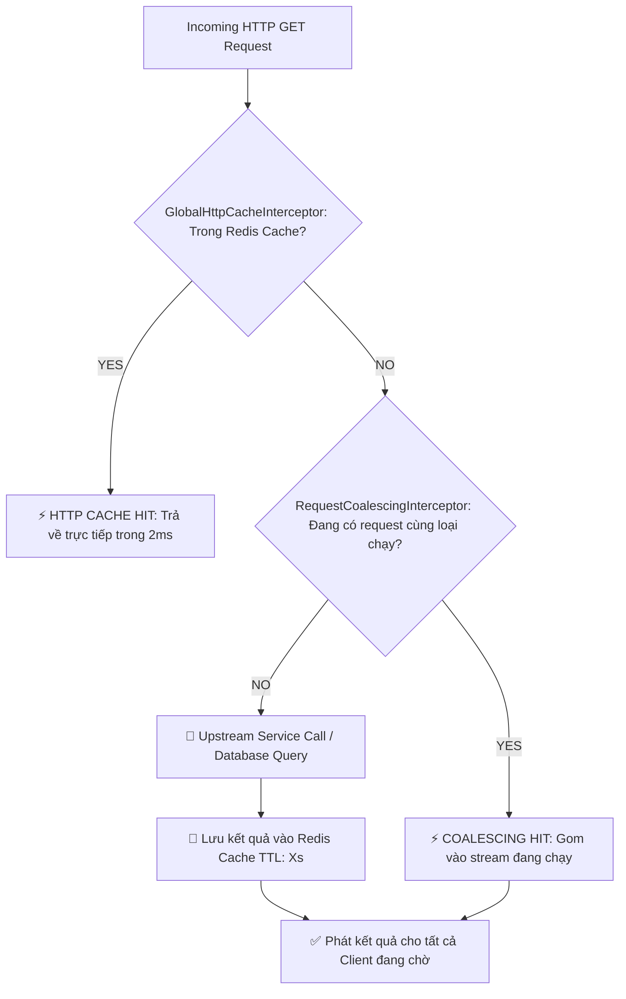

# 🌐 QuickBite API Gateway & BFF (Backend for Frontend)

> Cổng kết nối trung tâm (Edge API Gateway & BFF) của hệ sinh thái QuickBite, xây dựng bằng **NestJS 11**, tích hợp **JWKS Edge Security**, **Rate Limiting**, **3-tier Dynamic Configuration**, **Global HTTP GET Redis Cache** và **Request Coalescing Interceptor**.

---

## 📑 Mục lục
1. [Tính năng Nổi bật](#1-tính-năng-nổi-bật)
2. [Kiến trúc Tối ưu 2 Tầng (2-Layer Pipeline)](#2-kiến-trúc-tối-ưu-2-tầng-2-layer-pipeline)
3. [Cấu hình Động 3 Lớp (Dynamic Configuration)](#3-cấu-hình-động-3-lớp-dynamic-configuration)
4. [Biến Môi trường (.env)](#4-biến-môi-trường-env)
5. [Endpoints API](#5-endpoints-api)
6. [Cài đặt & Khởi chạy](#6-cài-đặt--khởi-chạy)
7. [Kiểm thử (Testing)](#7-kiểm-thử-testing)

---

## 1. Tính năng Nổi bật

* 🛡️ **Edge Security (JWKS + RS256):** Xác thực JSON Web Token trực tiếp tại Edge thông qua Public Keys của Identity Service, không truy vấn DB, giảm tải 100% cho IAM.
* ⚡ **Global HTTP GET Redis Cache:** Tự động cache toàn bộ kết quả của các endpoint GET với TTL động (`GET_CACHE_TTL`, 0s–120s), phản hồi siêu tốc (< 2ms).
* 🚀 **Request Coalescing (Chống Thundering Herd):** Sử dụng RxJS `shareReplay` gom nhóm các request đồng thời, chỉ gọi downstream service 1 lần duy nhất và phát kết quả cho tất cả clients.
* ⚙️ **3-Tier Dynamic Config:** Quản lý cấu hình microservices và tham số hiệu năng linh hoạt qua chuỗi fallback: **Redis ➔ MongoDB ➔ .env**.
* 📊 **BFF Aggregators:** Gom dữ liệu tổng hợp cho Admin Dashboard, Báo cáo Chuyên sâu (Advanced Reports) và Merchant POS.
* 💓 **Realtime Health Diagnostics & Wake-up:** Giám sát sức khỏe kết nối MongoDB, Redis và fan-out wake up toàn bộ microservices.

---

## 2. Kiến trúc Tối ưu 2 Tầng (2-Layer Pipeline)



---

## 3. Cấu hình Động 3 Lớp (Dynamic Configuration)

API Gateway đọc cấu hình hệ thống theo chuỗi ưu tiên:
1. **Redis Cache:** `gateway:config:{key}` (TTL: 60s).
2. **MongoDB:** Collection `GatewayConfig` (quản lý qua `/api/config/:key`).
3. **Local .env:** Biến môi trường cục bộ làm fallback khi ngắt kết nối database.

---

## 4. Biến Môi trường (.env)

```env
# Server
PORT=3001
NODE_ENV=development

# Redis Cache
REDIS_HOST=localhost
REDIS_PORT=6379
REDIS_USERNAME=
REDIS_PASSWORD=

# MongoDB Dynamic Config
MONGODB_URI=mongodb://localhost:27017/quickbite_gateway

# Rate Limiting & Performance
RATE_LIMIT_TTL=60000
RATE_LIMIT_MAX=100
# Global HTTP GET Cache TTL in seconds (min: 0, max: 120, default: 30)
GET_CACHE_TTL=30

# Request Coalescing (In-flight concurrency deduplication)
COALESCING_ENABLED=true
COALESCING_EXCLUDE_PATHS=
COALESCING_ADDITIONAL_HEADERS=

# Microservice URLs
IDENTITY_URL=http://localhost:44391
ORDER_URL=https://localhost:44386/api/app
CATALOG_URL=http://localhost:3000
INVENTORY_URL=http://localhost:8083/api/v1
PAYMENT_URL=http://localhost:8084/v1
```

---

## 5. Endpoints API

### 5.1. Admin Reports (BFF)
* `GET /api/admin/reports/charts`: Thống kê doanh thu theo ngày & phân bổ đơn hoàn thành/hủy (`startDate`, `endDate`, `status`, `merchantId`).
* `GET /api/admin/reports/details`: Bảng danh sách đơn hàng chi tiết có phân trang (`startDate`, `endDate`, `status`, `page`, `limit`).

### 5.2. Dynamic Config Management
* `GET /api/config/:key`: Xem giá trị biến cấu hình hiện tại.
* `POST /api/config/:key`: Cập nhật giá trị cấu hình vào MongoDB và làm mới Redis.

### 5.3. Health & Monitoring
* `GET /api/health`: Kiểm tra trạng thái Redis, MongoDB và các microservices.
* `GET /api/system/health/wake-up`: Fan-out đánh thức đồng thời toàn bộ microservices.

---

## 6. Cài đặt & Khởi chạy

```bash
# Cài đặt dependencies
npm install

# Khởi chạy chế độ phát triển
npm run start:dev

# Biên dịch production
npm run build

# Khởi chạy production
npm run start:prod
```

---

## 7. Kiểm thử (Testing)

```bash
# Chạy toàn bộ Unit Tests
npm test

# Chạy kiểm tra độ phủ (Coverage)
npm run test:cov
```
