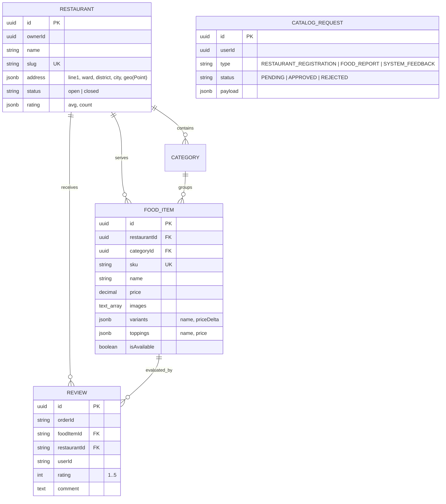

# 🍔 QuickBite Catalog Service

<p align="center">
  
  
  
  
  
  
</p>

---

## 📌 Overview

**QuickBite Catalog Service** powers the restaurant discovery, menu presentation, partner onboarding, and customer feedback ecosystem of QuickBite. Built with **NestJS 11** and **TypeORM**, it leverages **PostgreSQL** with native `JSONB` and array columns for dynamic item customization (variants & toppings) and spatial `Point` types for geospatial coordinates.

The service features an automated **Generic Request Center** for merchant onboarding with ACID transactions, a spam-resistant **Review Engine** with compound uniqueness constraints, and real-time Kafka event publishing to synchronize food metadata across the Order and Inventory services.

---

## 🏛️ Architecture & Entity Model



---

## 🌟 Key Features

1. **Flexible Customization Engine (JSONB):** Supports multi-tier food sizing (variants) and optional add-ons (toppings) stored as native JSONB structures.
2. **Generic Partner Request Center:** Prospective merchants submit registration requests. When an Admin approves a request, an atomic database transaction auto-provisions the new `Restaurant` and updates the user's merchant profile.
3. **Anti-Spam Review Integrity:** Compound unique index `(orderId, foodItemId)` ensures customers can only review purchased items once per completed order.
4. **Event-Driven Menu Synchronization:** Emits `food.item.synced` events to the `catalog-events` Kafka topic whenever items are created or updated, ensuring Order Service and Inventory Service maintain valid replicas.
5. **Decoupled JWKS Authentication:** Validates RS256 JWT tokens issued by the Identity Service directly against `/.well-known/jwks.json` with in-memory public key caching.

---

## 🛠️ Technology Stack & Dependencies

| Component | Technology | Description |
|---|---|---|
| **Framework** | `NestJS 11.0.1` (`@nestjs/core`, `@nestjs/common`) | Modular Node.js enterprise framework |
| **Language** | `TypeScript 5.7` | Type-safe backend development |
| **Database & ORM** | `PostgreSQL 16` (`pg 8.22`), `TypeORM 1.1.0` | ORM supporting native JSONB & Arrays |
| **Security & Auth** | `passport-jwt 4.0.1`, `jwks-rsa 4.1.0` | Asymmetric RS256 signature verification |
| **Message Broker** | `KafkaJS 2.2.4` | High-performance Kafka client for Node.js |
| **API Documentation** | `@nestjs/swagger 11.0.3` | OpenAPI 3.0 specification & Swagger UI |

---

## 📂 Project Structure

```
quick-bite-catalog/
└── src/
    ├── restaurant/                      # Restaurant entity, service, controller & search
    ├── category/                        # Menu category management by restaurant
    ├── food-item/                       # Food items, variants, toppings, and Kafka publisher
    ├── request/                         # Generic request center (Partner onboarding, reports)
    ├── review/                          # Customer reviews & rating calculations
    ├── auth/                            # JWKS Passport strategy, guards & role decorators
    ├── common/                          # Response envelopes, filters, interceptors, DTOs
    ├── health/                          # Liveness & readiness probes
    ├── app.module.ts                    # Root application module
    └── main.ts                          # Bootstrap entry point (Port 3000)
```

---

## ⚙️ Configuration & Environment Variables

Configured in `.env`:

```env
PORT=3000
NODE_ENV=development

# Database Configuration
DATABASE_HOST=localhost
DATABASE_PORT=5432
DATABASE_USER=postgres
DATABASE_PASSWORD=postgres
DATABASE_NAME=quickbite_catalog
DATABASE_SYNCHRONIZE=false

# Identity & Security
IDENTITY_SERVICE_URL=http://localhost:44391

# Apache Kafka
KAFKA_BROKERS=localhost:9092
KAFKA_CLIENT_ID=quickbite-catalog-service
```

---

## 📬 Kafka Events Published

| Topic | Key | Event Type | Description |
|---|---|---|---|
| **`catalog-events`** | `restaurantId` | `food.item.synced` | Published when food items are created/updated to sync replicas in Order & Inventory |
| **`catalog-events`** | `restaurantId` | `menu.updated` | Broadcasts general menu or category updates |

---

## 🔌 REST API Endpoints

**Default Port:** `3000` (All responses wrapped in standard API envelope `{ success, statusCode, data, ... }`)

### 1. Restaurant Endpoints
* `GET /restaurants`: List restaurants with pagination, search, and category filters.
* `GET /restaurants/me`: Get restaurant details owned by current authenticated Merchant.
* `PUT /restaurants/me`: Update merchant restaurant profile, operating status (`open`/`closed`), and address.
* `GET /restaurants/:id`: Retrieve detailed restaurant information and its categorized menu.
* `POST /restaurants`: Create a new restaurant (Admin only).

### 2. Food Item Endpoints
* `GET /food-items`: List food items with filters (`restaurantId`, `categoryId`, `search`).
* `GET /food-items/:id`: Get detailed food item (including `variants` and `toppings`).
* `POST /food-items`: Create a new food item with variants/toppings (Merchant/Admin).
* `PUT /food-items/:id`: Update food item details (Triggers Kafka `food.item.synced`).
* `DELETE /food-items/:id`: Soft delete or remove food item.

### 3. Request & Onboarding Endpoints
* `POST /requests`: Submit partner registration or report (`RESTAURANT_REGISTRATION`).
* `GET /requests`: List submitted requests (Admin only).
* `PATCH /requests/:id/approve`: Approve request and automatically create the restaurant entity.
* `PATCH /requests/:id/reject`: Reject request with admin review notes.

### 4. Review Endpoints
* `POST /reviews`: Submit a verified review for a completed order item.
* `GET /reviews/restaurant/:restaurantId`: List reviews and average ratings for a restaurant.

#### Sample Create Food Item Request (`POST /food-items`):
```json
{
  "restaurantId": "d92f82d1-d04d-4d2b-9a31-ee157a06f644",
  "categoryId": "7a1b2c3d-4e5f-6a7b-8c9d-0e1f2a3b4c5d",
  "sku": "BURGER-DELUXE",
  "name": "Deluxe Cheeseburger",
  "description": "Grilled Angus beef patty with cheddar cheese, lettuce, and secret sauce.",
  "price": 85000,
  "currency": "VND",
  "images": ["https://images.unsplash.com/photo-1568901346375-23c9450c58cd"],
  "isAvailable": true,
  "preparationTime": 15,
  "variants": [
    { "name": "Regular", "priceDelta": 0 },
    { "name": "Double Patty", "priceDelta": 30000 }
  ],
  "toppings": [
    { "name": "Extra Bacon", "price": 15000 },
    { "name": "Truffle Mayo", "price": 10000 }
  ]
}
```

---

## 🚀 Getting Started

### Prerequisites
* [Node.js 20.11+ LTS](https://nodejs.org/)
* [PostgreSQL 15+](https://www.postgresql.org/) (Database `quickbite_catalog`)
* [Apache Kafka 2.11+](https://kafka.apache.org/)

### 1. Installation
```bash
npm install
```

### 2. Running the Service
```bash
# Development mode with hot reload
npm run start:dev

# Production build and run
npm run build
npm run start:prod
```
The service will be listening at `http://localhost:3000`. Swagger documentation is available at `http://localhost:3000/api/docs`.
