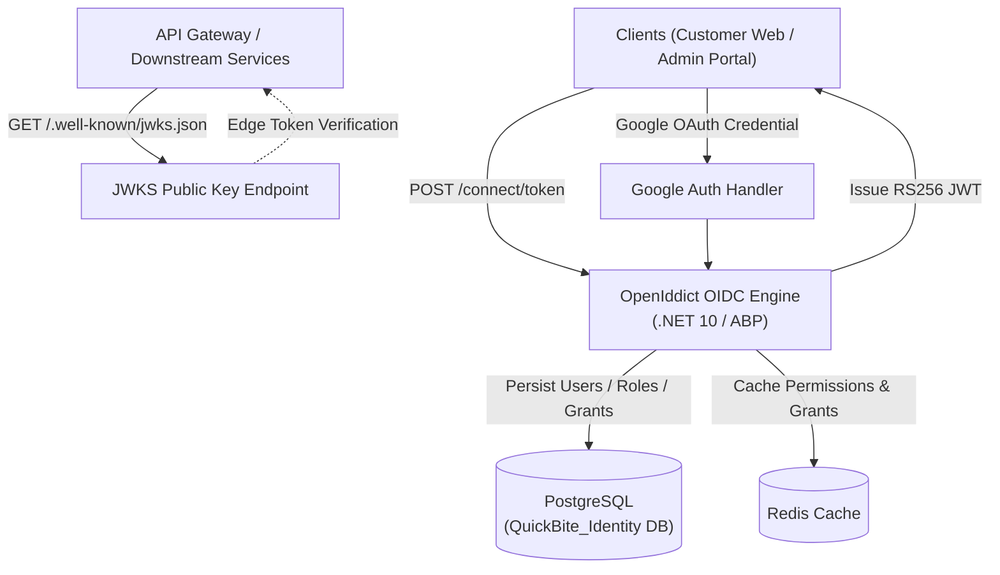

# 🔐 QuickBite Identity Service

<p align="center">
  
  
  
  
  
</p>

---

## 📌 Overview

**QuickBite Identity Service** is the centralized Identity & Access Management (IAM) authority of the QuickBite platform. Built on top of **.NET 10** and the **ABP Framework 10.0.0**, it acts as the primary OAuth 2.0 and OpenID Connect (OIDC) provider using **OpenIddict 7.2.0**.

The service is responsible for user registration, multi-role authentication (Customer, Merchant, Admin), fine-grained Role-Based Access Control (RBAC), Google OAuth integration, token issuance (RS256 signed JWTs), and exposing the public JSON Web Key Set (JWKS) discovery endpoints for edge token verification across the microservices ecosystem.

---

## 🏛️ Architecture & Key Responsibilities



### Core Responsibilities
* **Centralized IAM Authority:** Single source of truth for accounts, identity profiles, passwords (secure hashing), and session tokens.
* **OAuth 2.0 & OIDC Server:** Implements standard authorization flows:
  * `grant_type=password`: Direct authentication for first-party web & mobile clients.
  * `grant_type=refresh_token`: Seamless background token renewal (Silent Refresh).
  * `grant_type=client_credentials`: Machine-to-machine internal service communication.
* **Asymmetric RS256 Token Signing & JWKS:** Signs access tokens using an asymmetric private key and serves public keys at `/.well-known/jwks.json`. Edge services (API Gateway, Catalog, etc.) verify token validity locally without querying the Identity database.
* **Role-Based Access Control (RBAC):** Fine-grained permission trees per role (`Admin`, `Merchant`, `Customer`).
* **Multi-Tenancy & Social Login:** Native ABP multi-tenancy foundation and Google OAuth2 integration (`Microsoft.AspNetCore.Authentication.Google`).

---

## 🛠️ Technology Stack & Dependencies

| Component | Technology | Description |
|---|---|---|
| **Runtime & Framework** | `.NET 10.0`, `ABP Framework 10.0.0` | DDD layered architecture with modular domain building blocks |
| **Authentication Engine** | `OpenIddict 7.2.0` (`OpenIddict.Server.AspNetCore`) | RFC-compliant OAuth 2.0 / OIDC Authorization Server |
| **Database & ORM** | `PostgreSQL`, Entity Framework Core (`Volo.Abp.EntityFrameworkCore.PostgreSql`) | Relational persistence for identities, claims, and tokens |
| **Social Login** | `Microsoft.AspNetCore.Authentication.Google 7.0.0` | External identity provider delegation |
| **Cache & Distributed Store** | `StackExchange.Redis`, `Volo.Abp.Caching.StackExchangeRedis` | Fast permission lookup and distributed grant caching |
| **Structured Logging** | `Serilog.AspNetCore 9.0.0` | High-performance asynchronous structured logging |

---

## 📂 Project Structure

Following ABP Domain-Driven Design (DDD) layered architecture:

```
QuickBite.Identity/
├── src/
│   ├── QuickBite.Identity.Domain/                 # Aggregate roots (AppUser, AppRole), domain logic, OpenIddict entities
│   ├── QuickBite.Identity.Domain.Shared/          # Enums, constants, multi-lingual localization, error codes
│   ├── QuickBite.Identity.Application.Contracts/  # DTOs, Application Service interfaces, permission definitions
│   ├── QuickBite.Identity.Application/            # Application Services (AuthAppService, UserProfileAppService)
│   ├── QuickBite.Identity.EntityFrameworkCore/    # EF Core DbContext, PostgreSQL mappings, database migrations
│   ├── QuickBite.Identity.HttpApi/                # ASP.NET Core API controllers
│   ├── QuickBite.Identity.HttpApi.Client/         # C# HTTP Client proxies for inter-service communication
│   ├── QuickBite.Identity.DbMigrator/             # Database migration and initial seed console runner
│   └── QuickBite.Identity.Web/                    # Host entry point, OpenIddict server configuration, JWKS hosting
└── test/                                          # Unit and integration test suites
```

---

## ⚙️ Configuration & Environment Variables

Key configuration parameters inside `appsettings.json` / `appsettings.Production.json`:

```json
{
  "ConnectionStrings": {
    "Default": "Host=localhost;Port=5432;Database=QuickBite_Identity;Username=postgres;Password=postgres;"
  },
  "Redis": {
    "Configuration": "127.0.0.1:6379"
  },
  "App": {
    "SelfUrl": "http://localhost:44391",
    "CorsOrigins": "http://localhost:3001,http://localhost:3002,http://localhost:5173"
  },
  "Authentication": {
    "Google": {
      "ClientId": "YOUR_GOOGLE_CLIENT_ID",
      "ClientSecret": "YOUR_GOOGLE_CLIENT_SECRET"
    }
  }
}
```

---

## 🔌 API Endpoints & Protocols

**Default Host Port:** `44391` (HTTP)

### 1. OAuth2 / OpenID Connect Endpoints
| Method | Endpoint | Description | Request Type |
|---|---|---|---|
| `POST` | `/connect/token` | Exchange credentials for Access Token + Refresh Token | `application/x-www-form-urlencoded` |
| `GET` | `/.well-known/openid-configuration` | OpenID Connect discovery metadata | None |
| `GET` | `/.well-known/jwks.json` | Public RSA keys for RS256 token verification | None |

#### Token Request Example (`grant_type=password`):
```http
POST /connect/token HTTP/1.1
Host: localhost:44391
Content-Type: application/x-www-form-urlencoded

client_id=QuickBite_Web
&grant_type=password
&username=customer@quickbite.com
&password=Password123!
&scope=openid profile email roles offline_access
```

### 2. Identity Application Endpoints
| Method | Endpoint | Auth | Description |
|---|---|---|---|
| `POST` | `/api/app/auth/register` | Public | Register new user account (`Customer` or `Merchant`) |
| `POST` | `/api/app/auth/google-login` | Public | Authenticate via Google ID token |
| `GET` | `/api/app/auth/profile` | Bearer JWT | Retrieve current authenticated user profile & permissions |
| `PUT` | `/api/app/auth/profile` | Bearer JWT | Update user profile details |
| `GET` | `/api/identity/users` | Admin | List users with pagination and search |
| `GET` | `/api/identity/roles` | Admin | List system roles and permission sets |

---

## 🚀 Getting Started

### Prerequisites
* [.NET 10.0+ SDK](https://dotnet.microsoft.com/download)
* [PostgreSQL 15+](https://www.postgresql.org/)
* [Redis 6+](https://redis.io/)
* [ABP CLI](https://abp.io/docs/latest/cli) (`dotnet tool install -g Volo.Abp.Cli`)

### 1. Database Migration & Data Seeding
Before running the Web host for the first time, execute the DbMigrator to create database schemas, seed roles (`Admin`, `Merchant`, `Customer`), and initialize OpenIddict client applications:

```bash
cd src/QuickBite.Identity.DbMigrator
dotnet run
```

### 2. Running the Service
```bash
cd src/QuickBite.Identity.Web
dotnet run
```
The service will start at `http://localhost:44391`.

### 3. OpenIddict Signing Certificate (Production Setup)
For production deployments, configure RSA certificates for token encryption and signing:
```bash
dotnet dev-certs https -v -ep openiddict.pfx -p YourSecureCertificatePassword123!
```

---

## 🔒 Security Best Practices
* **Token Rotation:** Refresh tokens are revoked and rotated on every exchange to mitigate replay attacks.
* **JWKS Caching at Edge:** The API Gateway caches public keys from `/.well-known/jwks.json` with a 5-minute TTL and rate-limited refresh.
* **CORS Protection:** Configured to strictly allow designated client origins (`Customer Web`, `Admin Portal`, `API Gateway`).
