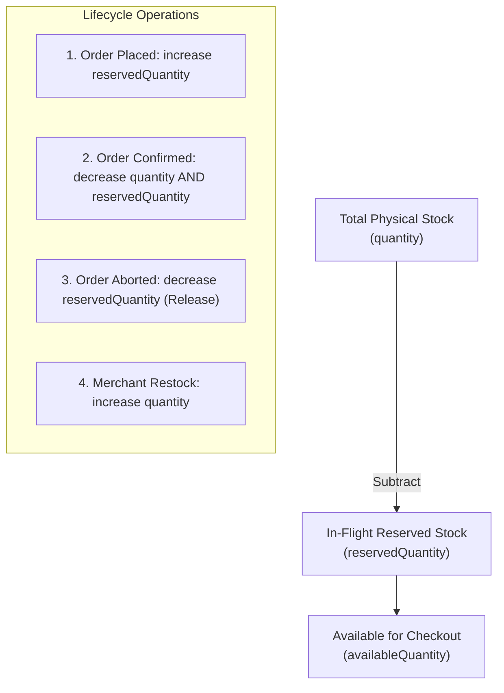
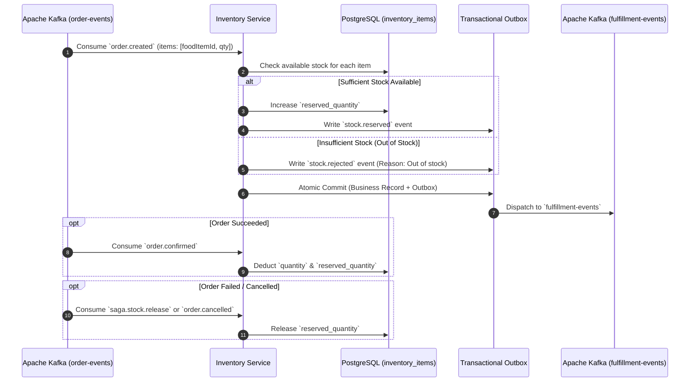

# 📦 QuickBite Inventory Service

<p align="center">
  
  
  
  
  
</p>

---

## 📌 Overview

**QuickBite Inventory Service** manages SKU material stock, real-time inventory holds, race-condition prevention, and asynchronous stock compensation across the QuickBite platform. Built with **Java 21** and **Spring Boot 3.3.2**, the service eliminates overselling during peak checkout traffic using a robust **3-metric ledger** (`quantity`, `reservedQuantity`, `availableQuantity`).

As a vital participant in the distributed checkout Saga, it coordinates with the Order Service through **Apache Kafka**, automatically reserving stock upon order placement, finalizing inventory deductions upon payment confirmation, and immediately releasing reserved items if downstream order processing aborts.

---

## 📊 3-Metric Stock Architecture & Calculations



### Formulae:
$$\text{availableQuantity} = \max(0, \text{quantity} - \text{reservedQuantity})$$
* **Hold Stock:** If $\text{availableQuantity} \ge \text{requestedQty}$, $\text{reservedQuantity} \leftarrow \text{reservedQuantity} + \text{requestedQty}$.
* **Confirm Order:** $\text{quantity} \leftarrow \text{quantity} - \text{requestedQty}$ and $\text{reservedQuantity} \leftarrow \text{reservedQuantity} - \text{requestedQty}$.
* **Release (Compensation):** $\text{reservedQuantity} \leftarrow \text{reservedQuantity} - \text{requestedQty}$.

---

## 🔄 Distributed Saga Inventory Lifecycle



---

## 🛠️ Technology Stack & Dependencies

| Component | Technology | Description |
|---|---|---|
| **Language & Runtime** | `Java 21 (LTS)` | Virtual Threads & modern language constructs |
| **Framework** | `Spring Boot 3.3.2` | Spring Web, Spring Data JPA, Spring Kafka |
| **Database** | `PostgreSQL 16` (`org.postgresql:postgresql`) | Relational persistence for stock ledgers and outbox/inbox |
| **Concurrency Control** | Optimistic Locking (`@Version`) | Zero thread blocking under high concurrent cart checkout |
| **Event Broker** | `Spring Kafka` (`spring-kafka`) | Event-driven integration with Order & Catalog services |
| **Documentation** | `SpringDoc OpenAPI 2.6.0` | Swagger UI (`/api/v1/swagger-ui.html`) |

---

## 📂 Project Structure

```
quick-bite-inventory/
└── src/main/java/com/quickbite/inventory/
    ├── entity/                          # InventoryItem, InventoryFoodItem (Replica), OutboxMessage, InboxMessage
    ├── repository/                      # Spring Data JPA Repositories
    ├── service/                         # InventoryService (Reserve, Confirm, Release, Restock logic)
    ├── controller/                      # REST API Endpoints (/api/v1/inventory/...)
    ├── kafka/                           # Kafka Consumers (OrderEventConsumer, CatalogEventConsumer) & Producer
    ├── dto/                             # Request and Response Data Transfer Objects
    └── config/                          # Kafka, OpenAPI, and Database configuration
```

---

## ⚙️ Configuration & Environment Variables

Configured in `application.yml`:

```yaml
server:
  port: 8083
  servlet:
    context-path: /api/v1

spring:
  application:
    name: quickbite-inventory-service
  datasource:
    url: ${SPRING_DATASOURCE_URL:jdbc:postgresql://localhost:5432/quickbite_inventory}
    username: ${SPRING_DATASOURCE_USERNAME:postgres}
    password: ${SPRING_DATASOURCE_PASSWORD:postgres}
    driver-class-name: org.postgresql.Driver
  jpa:
    hibernate:
      ddl-auto: update
    show-sql: false
  kafka:
    bootstrap-servers: ${KAFKA_BOOTSTRAP_SERVERS:localhost:9092}
    consumer:
      group-id: inventory-service-group
      auto-offset-reset: earliest

springdoc:
  swagger-ui:
    path: /swagger-ui.html
```

---

## 📬 Kafka Event Contracts

| Topic | Key | Role | Event Types | Description |
|---|---|---|---|---|
| **`order-events`** | `orderId` | Consumer | `order.created`, `order.confirmed`, `order.cancelled` | Triggers stock hold, final deduct, or compensation release |
| **`fulfillment-events`** | `orderId` | Producer | `stock.reserved`, `stock.rejected` | Reports stock reservation status to Order Saga Orchestrator |
| **`catalog-events`** | `restaurantId` | Consumer | `food.item.synced` | Synchronizes food item metadata into local replica |

---

## 🔌 REST API Endpoints

**Context Base Path:** `http://localhost:8083/api/v1`

| Method | Endpoint | Description |
|---|---|---|
| `GET` | `/api/v1/inventory/items/{foodItemId}` | Get stock metrics (`quantity`, `reservedQuantity`, `availableQuantity`) |
| `POST` | `/api/v1/inventory/items` | Initialize stock ledger for a newly created food item |
| `PUT` | `/api/v1/inventory/items/{foodItemId}/stock` | Merchant update / Restock physical quantity |
| `POST` | `/api/v1/inventory/reserve` | Manual stock reservation endpoint (Testing & Admin) |
| `POST` | `/api/v1/inventory/release` | Manual stock release endpoint (Testing & Admin) |

#### Sample Restock Request (`PUT /api/v1/inventory/items/{foodItemId}/stock`):
```json
{
  "quantity": 100
}
```

#### Sample Stock Status Response:
```json
{
  "success": true,
  "statusCode": 200,
  "message": "Stock retrieved successfully.",
  "data": {
    "id": "7b8a9c0d-1e2f-3a4b-5c6d-7e8f9a0b1c2d",
    "foodItemId": "3fa85f64-5717-4562-b3fc-2c963f66afa6",
    "quantity": 100,
    "reservedQuantity": 5,
    "availableQuantity": 95,
    "updatedAt": "2026-08-25T10:15:30Z"
  }
}
```

---

## 🚀 Getting Started

### Prerequisites
* [Java 21 JDK](https://adoptium.net/)
* [PostgreSQL 15+](https://www.postgresql.org/) (Database `quickbite_inventory`)
* [Apache Kafka 2.11+](https://kafka.apache.org/)

### 1. Build and Run
```bash
# Using Maven Wrapper
./mvnw clean spring-boot:run

# Or package into a JAR
./mvnw clean package -DskipTests
java -jar target/inventory-service-0.0.1-SNAPSHOT.jar
```

### 2. Access Swagger OpenAPI UI
Open your browser at:
`http://localhost:8083/api/v1/swagger-ui.html`
