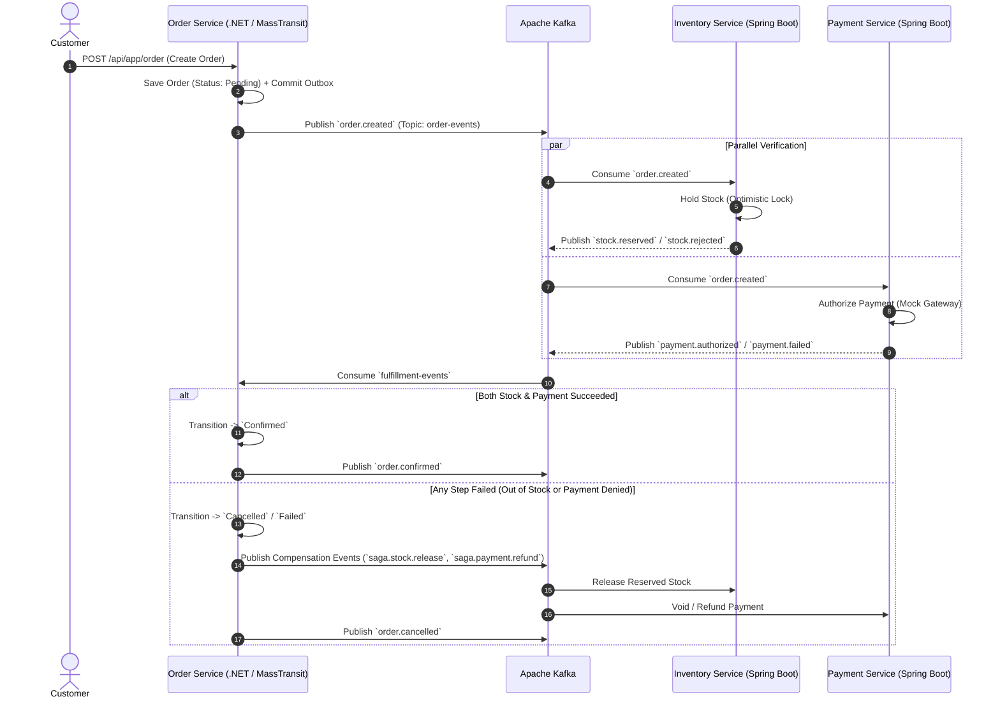

# 📦 QuickBite Order Service

<p align="center">
  
  
  
  
  
</p>

---

## 📌 Overview

**QuickBite Order Service** is the central transactional core and distributed **Saga Orchestrator** of the QuickBite platform. Built with **.NET 10** and the **ABP Framework 10.0.0**, it manages the complete lifecycle of customer orders and coordinates cross-microservice transactions across **Inventory** and **Payment** services using an event-driven **MassTransit State Machine**.

The service enforces strict transactional boundaries, ACID storage in **MySQL**, reliable messaging via **Transactional Outbox & Idempotent Inbox**, and local replication of food catalog data for lightning-fast price computation and validation.

---

## 🔄 Distributed Saga Orchestration & State Machine

Order Service coordinates asynchronous multi-service checkout workflows through **Apache Kafka** without distributed locks:



### Order Lifecycle State Machine
```
[Draft] ➔ [Pending] ➔ [WaitingStock / WaitingPayment] ➔ [Confirmed] ➔ [Preparing] ➔ [Delivering] ➔ [Completed]
               │                                            │
               └───► [Cancelled / Failed] ◄─────────────────┘
                     (Compensation triggered)
```

---

## 🛡️ Reliability: Outbox & Inbox Patterns

* **Transactional Outbox:** Domain changes and pending events (`OutboxMessage`) are committed within the **same atomic MySQL transaction**. Background publishers poll pending messages and guarantee at-least-once delivery to Kafka.
* **Idempotent Consumer (Inbox):** Inbound Kafka messages check the `InboxMessage` ledger by `eventId` before execution, eliminating duplicate processing.
* **Periodic Cleanup:** ABP background worker (`InboxCleanupWorker`) cleans up processed records older than 7 days to maintain optimal database performance.

---

## 🛠️ Technology Stack & Dependencies

| Component | Technology | Description |
|---|---|---|
| **Runtime & Framework** | `.NET 10.0`, `ABP Framework 10.0.0` | DDD Layered Architecture |
| **Database & ORM** | `MySQL 8.0`, `Volo.Abp.EntityFrameworkCore.MySQL 10.0.0` | ACID relational storage for order aggregates and outbox |
| **Saga Orchestrator** | `MassTransit 8.3.6`, `MassTransit.Kafka`, `MassTransit.EntityFrameworkCore` | State machine persistence and saga routing |
| **Message Broker** | `Confluent.Kafka 2.11.1`, `Volo.Abp.EventBus.Kafka` | High-throughput event streaming |
| **Background Tasks** | `Volo.Abp.BackgroundWorkers 10.0.0` | Scheduled outbox dispatcher & inbox maintenance |
| **Documentation & Logs** | Swagger / OpenAPI, `Serilog.AspNetCore` | API documentation & structured logging |

---

## 📂 Project Structure

```
QuickBite.Order/
├── src/
│   ├── QuickBite.Order.Domain/                 # Aggregate Root (Order), Entities (OrderItem, OrderStatusHistory), Value Objects
│   ├── QuickBite.Order.Domain.Shared/          # Enums (OrderStatus, ChangedBy), Event Transfer Objects (ETOs), TopicConstants
│   ├── QuickBite.Order.Application.Contracts/  # DTOs (CreateOrderDto, OrderDto), IOrderAppService interface
│   ├── QuickBite.Order.Application/            # OrderAppService implementation, Event Handlers, Price validation logic
│   ├── QuickBite.Order.EntityFrameworkCore/    # OrderDbContext (MySQL), Migrations, Outbox & Inbox table mappings
│   ├── QuickBite.Order.Infrastructure/         # MassTransit State Machine, Kafka Producers/Consumers, Background Workers
│   ├── QuickBite.Order.HttpApi/                # ASP.NET Core REST API Controllers
│   ├── QuickBite.Order.HttpApi.Client/         # C# HTTP Client Proxies
│   ├── QuickBite.Order.DbMigrator/             # MySQL migration runner and schema initializer
│   └── QuickBite.Order.HttpApi.Host/           # Host startup, Swagger, Serilog, and DI configuration
└── test/                                       # Unit tests and domain invariant assertions
```

---

## ⚙️ Configuration & Environment Variables

Inside `appsettings.json` / `appsettings.Production.json`:

```json
{
  "ConnectionStrings": {
    "Default": "Server=localhost;Port=3306;Database=QuickBite_Order;Uid=root;Pwd=root;"
  },
  "Kafka": {
    "BootstrapServers": "localhost:9092",
    "GroupId": "quickbite-order-service-group"
  },
  "AuthServer": {
    "Authority": "http://localhost:44391",
    "RequireHttpsMetadata": "false"
  },
  "App": {
    "SelfUrl": "http://localhost:44386",
    "CorsOrigins": "http://localhost:3001,http://localhost:3002,http://localhost:5173"
  }
}
```

---

## 📬 Kafka Topics & Event Contracts

Configured in `TopicConstants.cs`:

| Topic | Partition Key | Role | Event Types | Description |
|---|---|---|---|---|
| **`order-events`** | `orderId` | Producer | `order.created`, `order.confirmed`, `order.cancelled` | Broadcasts order state changes to downstream services |
| **`fulfillment-events`** | `orderId` | Consumer | `stock.reserved`, `stock.rejected`, `payment.authorized`, `payment.failed` | Receives verification results from Inventory & Payment |
| **`catalog-events`** | `restaurantId` | Consumer | `food.item.synced`, `menu.updated` | Replicates menu items to local `AppFoodItems` MySQL table |
| **`notification-events`** | `userId` | Producer | `order.status.updated` | Emits user notification events |

---

## 🔌 API Endpoints

**Default Host Port:** `44386` (HTTP)

| Method | Endpoint | Auth | Description |
|---|---|---|---|
| `POST` | `/api/app/order` | Bearer JWT | Create new order (Triggers Saga & publishes `order.created`) |
| `GET` | `/api/app/order/{id}` | Bearer JWT | Get full order details (Items, GPS address, status history) |
| `GET` | `/api/app/order` | Bearer JWT | Query orders with pagination (`customerId`, `restaurantId`, `status`) |
| `PUT` | `/api/app/order/{id}/cancel` | Bearer JWT | Cancel order (Triggers compensation flow if confirmed) |
| `PUT` | `/api/app/order/{id}/status` | Bearer JWT | Update operational status (`Preparing`, `Delivering`, `Completed`) |

#### Sample Create Order Request (`POST /api/app/order`):
```json
{
  "restaurantId": "3fa85f64-5717-4562-b3fc-2c963f66afa6",
  "items": [
    {
      "sku": "FOOD-BURGER-01",
      "itemName": "Double Beef Burger",
      "quantity": 2,
      "unitPrice": 85000,
      "selectedVariantName": "Large",
      "selectedToppings": "[{\"name\":\"Extra Cheese\",\"price\":10000}]"
    }
  ],
  "deliveryAddress": {
    "line1": "456 Le Loi Street",
    "ward": "Ben Nghe",
    "district": "District 1",
    "city": "Ho Chi Minh City",
    "latitude": 10.7769,
    "longitude": 106.7009
  },
  "paymentMethod": "MOCK_PAYMENT"
}
```

---

## 🚀 Getting Started

### Prerequisites
* [.NET 10.0+ SDK](https://dotnet.microsoft.com/download)
* [MySQL 8.0+](https://www.mysql.com/)
* [Apache Kafka 2.11+](https://kafka.apache.org/) (Running on `localhost:9092`)

### 1. Database Migration
Run the DbMigrator console project to apply EF Core migrations to MySQL:
```bash
cd src/QuickBite.Order.DbMigrator
dotnet run
```

### 2. Running the Service
```bash
cd src/QuickBite.Order.HttpApi.Host
dotnet run
```
The service will start at `http://localhost:44386`. Swagger UI is available at `http://localhost:44386/swagger`.
