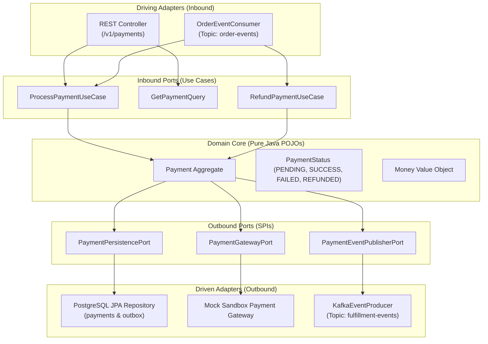
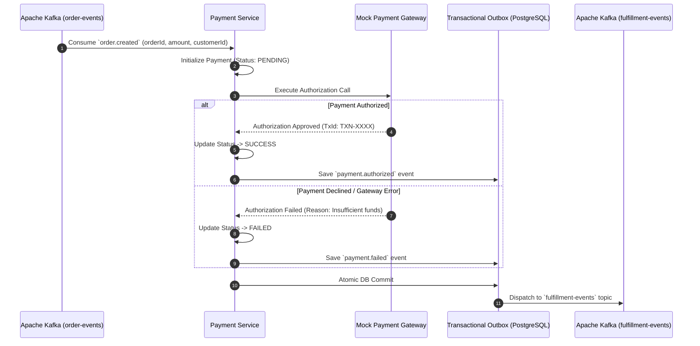

# 💳 QuickBite Payment Service

<p align="center">
  
  
  
  
  
</p>

---

## 📌 Overview

**QuickBite Payment Service** handles financial transaction processing, payment gateway integration, sandbox simulation, and distributed saga compensation. Engineered with **Java 21** and **Spring Boot 3.3.2**, the service strictly adopts **Hexagonal (Ports & Adapters) Architecture** to decouple core domain logic from external payment providers and messaging infrastructures.

The service participates in the distributed checkout Saga coordinated by the Order Service via **Apache Kafka**, supporting real-time payment authorization, automated refunds/voids on failure, and **Transactional Outbox / Inbox** ledgers for zero dual-write anomalies.

---

## 🏛️ Hexagonal Architecture (Ports & Adapters)



---

## 🛡️ Distributed Saga & Compensation Flow



---

## 🛠️ Technology Stack & Dependencies

| Component | Technology | Description |
|---|---|---|
| **Language & Runtime** | `Java 21 (LTS)` | Modern JVM features (Virtual Threads, Records, Pattern Matching) |
| **Framework** | `Spring Boot 3.3.2` | Enterprise application foundation |
| **Persistence** | `Spring Data JPA`, `Hibernate 6`, `PostgreSQL Driver` | Transactional relational mapping |
| **Messaging** | `Spring Kafka` (`spring-kafka 3.2.x`) | Event streaming consumer & producer |
| **API Documentation** | `SpringDoc OpenAPI 2.6.0` | Interactive Swagger UI (`/v1/swagger-ui.html`) |
| **Utilities** | `Lombok`, `MapStruct` | Boilerplate reduction and DTO mapping |

---

## 📂 Project Structure

```
quick-bite-payment/
└── src/main/java/com/quickbite/payment/
    ├── domain/                          # Core Domain Model (POJOs, no Spring dependencies)
    │   └── model/                       # Payment, PaymentStatus, PaymentMethod, Money
    ├── application/                     # Application Layer (Use Cases & Business Orchestration)
    │   ├── port/
    │   │   ├── in/                      # Input Ports: ProcessPaymentUseCase, RefundUseCase
    │   │   └── out/                     # Output Ports: PaymentPersistencePort, PaymentGatewayPort
    │   └── service/                     # Application Services implementing input ports
    └── adapter/                         # Adapters Layer (Infrastructure & Delivery)
        ├── in/
        │   ├── web/                     # REST Controllers & Request/Response DTOs
        │   └── messaging/               # Kafka OrderEventConsumer
        └── out/
            ├── persistence/             # Spring Data JPA Entities, Repositories, Outbox/Inbox
            ├── gateway/                 # MockPaymentGatewayAdapter (Sandbox simulator)
            └── messaging/               # KafkaEventPublisher (fulfillment-events)
```

---

## ⚙️ Configuration & Environment Variables

Configured in `application.yml` or overridden via environment variables:

```yaml
server:
  port: 8084
  servlet:
    context-path: /v1

spring:
  application:
    name: quickbite-payment-service
  datasource:
    url: ${SPRING_DATASOURCE_URL:jdbc:postgresql://localhost:5432/quickbite_payment}
    username: ${SPRING_DATASOURCE_USERNAME:postgres}
    password: ${SPRING_DATASOURCE_PASSWORD:postgres}
    driver-class-name: org.postgresql.Driver
  jpa:
    hibernate:
      ddl-auto: update
    show-sql: false
  kafka:
    bootstrap-servers: ${KAFKA_BOOTSTRAP_SERVERS:localhost:9092}
    consumer:
      group-id: payment-service-group
      auto-offset-reset: earliest

springdoc:
  swagger-ui:
    path: /swagger-ui.html
```

---

## 📬 Kafka Event Contracts

| Topic | Key | Direction | Event Types | Description |
|---|---|---|---|---|
| **`order-events`** | `orderId` | Consumer | `order.created`, `order.cancelled` | Triggers initial payment or compensation refund |
| **`fulfillment-events`** | `orderId` | Producer | `payment.authorized`, `payment.failed` | Transmits payment outcome to Order Saga Orchestrator |

---

## 🔌 REST API Endpoints

**Context Base Path:** `http://localhost:8084/v1`

### 1. Payment Query Endpoints
* `GET /v1/payments/{id}`: Traverses and retrieves transaction details by Payment UUID.
* `GET /v1/payments/order/{orderId}`: Traverses and retrieves payment records associated with a specific Order ID.

### 2. Mock Sandbox Simulation Endpoint
* `POST /v1/payments/mock/process`: Manually triggers a mock payment authorization to test Saga success and failure workflows.

#### Sample Mock Request:
```json
{
  "orderId": "a1b2c3d4-e5f6-7a8b-9c0d-1e2f3a4b5c6d",
  "customerId": "8f2a1c3d-4e5b-6c7d-8e9f-0a1b2c3d4e5f",
  "amount": 170000.00,
  "method": "MOCK_PAYMENT",
  "simulateFailure": false
}
```

#### Sample Response:
```json
{
  "success": true,
  "statusCode": 200,
  "message": "Payment authorized successfully.",
  "data": {
    "id": "e4d3c2b1-0f9e-8d7c-6b5a-4f3e2d1c0b9a",
    "orderId": "a1b2c3d4-e5f6-7a8b-9c0d-1e2f3a4b5c6d",
    "amount": 170000.00,
    "status": "SUCCESS",
    "method": "MOCK_PAYMENT",
    "transactionId": "TXN-MOCK-928471"
  }
}
```

---

## 🚀 Getting Started

### Prerequisites
* [Java 21 JDK (Amazon Corretto, Temurin, or Oracle)](https://adoptium.net/)
* [PostgreSQL 15+](https://www.postgresql.org/) (Database `quickbite_payment`)
* [Apache Kafka 2.11+](https://kafka.apache.org/)

### 1. Build and Run
```bash
# Using Maven Wrapper
./mvnw clean spring-boot:run

# Or package into a JAR
./mvnw clean package -DskipTests
java -jar target/payment-service-0.0.1-SNAPSHOT.jar
```

### 2. Access Swagger OpenAPI UI
Open your browser at:
`http://localhost:8084/v1/swagger-ui.html`
